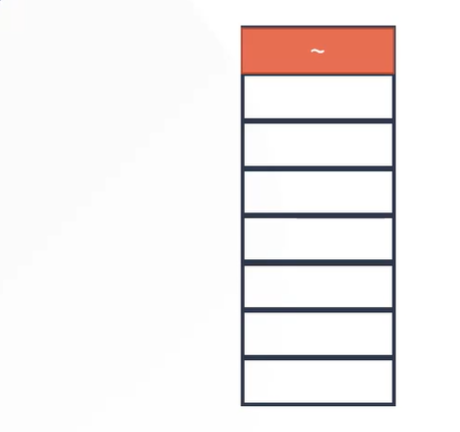
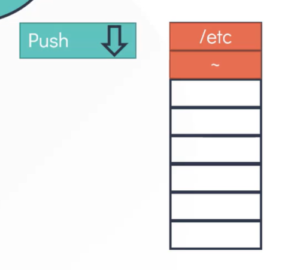
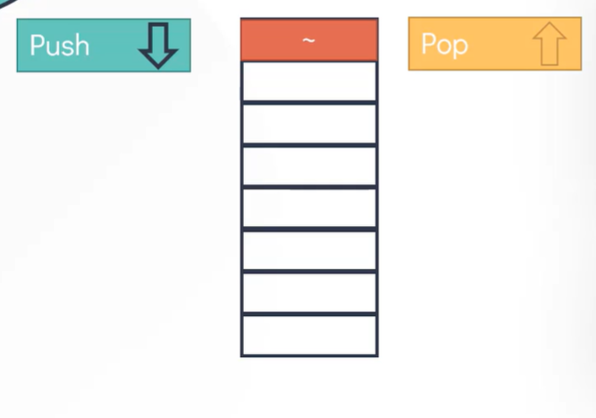

# Linux basics course
## Basic Linux commands 

pwd (present working directory)

    pwd
    /home/michael

Ls (List Contents)

    ls

mkdir (make a new directory)

    mkdir Asia

mkdir (multiple directory)

    mkdir Europe Africa America

ls (List contents)

    ls
    Asia Europe Africa America

cd (change directory)

    cd Asia

    pwd
    /home/michael/Asia

    mkdir India?Mumbai

    mkdir -p India/Mumbai

Goto Home Directory 

    cd ..
or

    cd

or

    cd /home/michael

### Absolute and Relative Path

    pwd
    /home/michael

Absolute Path

    cd /home/michael/Asia

Relative Path

    cd Asia

### Pro Tip- pushd/popd

    [~] pushd /etc
    /etc ~

    [/etc] cd /var
    [/var] cd /tmp

    [/tmp] popd
    [~]

 
 
 